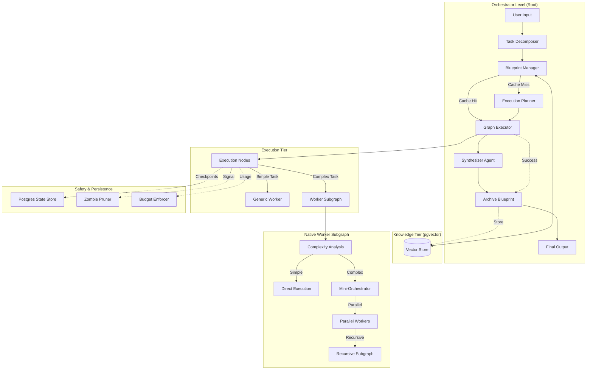

# Self-Spawn Agents: High Level Architecture Design Document

**Version:** 1.0
**Date:** 2026-02-08
**Status:** Living Document

## 1. Executive Summary

The **Self-Spawn Agents** system is a production-ready agentic orchestration platform designed to handle complex, multi-step tasks through recursive decomposition and dynamic execution. It leverages a graph-based architecture to break down high-level user goals into atomic subtasks, executes them in parallel or sequentially, and synthesizes the results into a coherent output.

Key capabilities include:
-   **Dynamic Graph Generation:** Compiles custom execution graphs at runtime based on task requirements.
-   **Recursive Decomposition:** Spawns lightweight "Native Worker Subgraphs" for complex sub-problems, supporting multi-level hierarchy (Depth 0 → 1 → 2 → 3).
-   **Semantic Blueprint Caching:** Reuses successful execution strategies for similar tasks using vector similarity search, bypassing expensive planning LLM calls.
-   **Long-Term Semantic Memory:** Persists execution "blueprints" in a vector-enabled database (pgvector) for cross-run learning.
-   **Self-Healing & Safety:** Implements "Zombie Branch Pruning" to stop failed parallel branches and "Budget Caps" to control costs.

## 2. System Architecture

The system follows a modular, graph-based architecture powered by **LangGraph**. The core orchestrator manages the flow of data between specialized agents, while a native worker subgraph handles recursive execution.



## 3. Core Modules

The system is composed of several distinct modules, each responsible for a specific phase of the agentic lifecycle.

### Module 1: Semantic Intent Analysis
-   **Component:** `SemanticSplitter` (now `TaskDecomposer`)
-   **Role:** Decomposes user prompts into structured `SubtaskList` objects.
-   **Function:**
    -   Analyzes user intent.
    -   Breaks down abstract goals into concrete steps.
    -   Optimizes subtasks for search retrieval.

### Module 2: Supervisor & Graph Planning
-   **Component:** `SupervisorAgent` (now `ExecutionPlanner`)
-   **Role:** Plans the execution strategy.
-   **Function:**
    -   Maps subtasks to specific agent roles (Researcher, Coder, Orchestrator).
    -   Generates a dependency graph (Blueprint).
    -   Identifies parallel vs. sequential tasks.

### Module 3: Dynamic Graph Compiler
-   **Component:** `GraphCompiler` (now `GraphExecutor`)
-   **Role:** Builds and executes the runtime graph.
-   **Function:**
    -   Translates the Blueprint into an executable `StateGraph`.
    -   Manages node execution and state transitions.
    -   Enforces safety checks (Zombie Pruning, Global Signals).

### Module 4: Native Worker Subgraph
-   **Component:** `WorkerSubgraph`
-   **Role:** Efficiently executes subtasks.
-   **Function:**
    -   **Smart Complexity Detection:** Uses heuristics and LLM to decide if a task needs decomposition.
    -   **Mini-Orchestration:** Creates mini-plans for complex tasks (2-4 parallel workers).
    -   **Recursive Spawning:** Spawns child subgraphs for deeply nested tasks.
    -   **Context Compression:** Automatically compresses results using density-aware summarization before returning to parent.
    -   **Direct Execution:** Handles simple tasks with minimal overhead.

### Module 5: Synthesis & Delivery
-   **Component:** `SynthesizerAgent`
-   **Role:** Aggregates results.
-   **Function:**
    -   Combines outputs from all nodes.
    -   Generates the final markdown report.
    -   Ensures the response answers the original user prompt.

### Module 6: Safety & Escalation
-   **Components:** Logic for Pruning, Budgets, and Persistence.
-   **Function:**
    -   **Zombie Branch Pruning:** Kills sibling branches if one fails critically.
    -   **Budget Caps:** Enforces `max_cost` and `max_steps` limits.
    -   **Atomic Persistence:** Saves state after every node using Postgres (`AsyncPostgresSaver`).

### Module 7: Semantic Memory & Blueprint Caching
-   **Component:** `KnowledgeService` & `BlueprintManager`
-   **Role:** Long-term memory and optimization tier.
-   **Function:**
    -   **Vector Archival:** Stores successful execution "blueprints" indexed by task intent in `pgvector`.
    -   **Blueprint Recall:** Uses `pgvector` similarity search to retrieve existing strategies for recurring tasks.
    -   **Strategic Shortcut:** Skips the entire `Execution Planner` phase on high-confidence matches (>0.85 similarity).
    -   **Rationale (Blueprint vs. Result):** We cache the **Strategy (Blueprint)** rather than the final result to ensure data recency. Worker agents still fetch fresh data, but the agent doesn't waste compute "re-thinking" how to solve the problem.

## 4. Data Flow & State Management

The system uses a shared `AgentState` to maintain context across the graph.

### AgentState Schema
```python
class AgentState(TypedDict):
    task: str           # Original user prompt
    subject: str        # Drift prevention context
    subtasks: List[str] # Decomposed steps
    graph_plan: Dict    # Execution blueprint
    results: Dict       # Key-value store of node outputs
    depth: int          # Recursion level
    synthesis: str      # Final output
    # Safety & HITL
    inner_thread_id: str
    global_signal: str  # e.g., "INTERRUPT"
    usage_stats: Dict   # Cost tracking
    budget_config: Dict # Limits
    blueprint_id: str
    blueprint_cache_hit: bool
    blueprint_similarity: float
    blueprint_archived: bool
```

### Execution Flow
1.  **Input:** User provides a task.
2.  **Decomposition:** `TaskDecomposer` breaks the goal into subtasks.
3.  **Recall:** `BlueprintManager` queries `KnowledgeService` for a semantic match.
4.  **Routing:**
    -   **Cache Hit:** If a high-confidence blueprint is found, the system skips planning and proceeds directly to `GraphExecutor` using the retrieved blueprint.
    -   **Cache Miss:** If no suitable blueprint is found, the system proceeds to `ExecutionPlanner`.
5.  **Planning:** `ExecutionPlanner` maps subtasks to agents and dependencies, generating a new blueprint.
6.  **Execution:** `GraphExecutor` runs nodes, spawning subgraphs as needed, following the chosen blueprint.
7.  **Synthesis:** `SynthesizerAgent` compiles the final report.
8.  **Archival:** For successful runs, the generated blueprint is stored in `pgvector` by the `Archive Blueprint` component for future reuse.

## 5. Key Features & Capabilities

### 5.1 Recursive Decomposition (Native Subgraphs)
Instead of spawning full orchestrators, the system uses lightweight "Native Worker Subgraphs".
-   **Benefits:** Reduces latency (60-70%), lowers cost, and provides unified tracing.
-   **Mechanism:** `should_decompose` checks task complexity. If complex, `create_mini_plan` generates parallel sub-workers.

### 5.2 Time Travel & Human-in-the-Loop
-   **State Hydration:** Ability to clone past runs into new threads.
-   **Surgical Rewind:** Invalidate specific nodes and replay from that point (Fork & Rewind).
-   **Interrupt Bubbling:** Inner graph pauses propagate to the root level.

### 5.3 Safety Mechanisms
-   **Zombie Pruning:** Prevents token waste by stopping parallel branches when a sibling fails.
-   **Budget Enforcer:** Strict cost limits with 100% parity between state and cost tracker.

### 5.4 Context Engineering
-   **Instructional Architecture:** XML-tagged prompts (`<role>`, `<objective>`, `<constraints>`).
-   **Context Compression:** Pruning, Extraction, Scrubbing, and Refinement to manage token limits.

## 6. Technology Stack

-   **Backend:** Python, FastAPI
-   **Orchestration:** LangGraph, LangChain
-   **Runtime:** AsyncIO
-   **Sandboxing:** E2B Code Interpreter
-   **Persistence:** PostgreSQL (AsyncPostgresSaver), pgvector
-   **Frontend:** React (for Visualization)

## 7. Future Roadmap (Phase 3)

-   **System Stress Testing:** Validate Postgres persistence under high load.
-   **UI Refinement:** Polish the "Developer" UI for broader use.
-   **Deployment:** Finalize Docker configuration and production deployment pipeline.

## 8. Current State Assessment (Industry Standard Analysis)

**Maturity Level:** **Level 3 - High-Fidelity Pilot**
*(System is functional, reliable, and capable of complex tasks, but lacks enterprise-grade optimization and long-term memory.)*

### Architectural Quality Attributes

| Attribute | Status | Details |
| :--- | :--- | :--- |
| **Reliability** | 🟢 **High** | **Atomic Persistence** (Postgres) ensures no data loss. **Zombie Pruning** prevents runaway processes. **Isolation** via E2B sandboxes protects the host. |
| **Observability** | 🟢 **High** | **Distributed Tracing** (LangSmith) provides deep visibility. **Real-time Cost Tracking** (8-decimal precision) offers financial transparency. **Visualizer** renders live graph states. |
| **Maintainability** | 🟢 **High** | **Modular Architecture** (Graph Compiler, Native Subgraphs) allows easy extension. **TypedDict** state schemas ensure type safety. |
| **Scalability** | 🟡 **Moderate** | **AsyncPostgresSaver** enables concurrency, but **System Stress Testing** under high load is pending. Rate limiting logic is basic. |
| **Performance** | 🟢 **High** | **Native Subgraphs** reduced latency by 60%. **Blueprint Caching** now bypasses planning for recurring tasks, reducing latency by an additional 2-5 seconds. |
| **Intelligence** | 🟢 **High** | Excellent procedural reasoning. **Semantic Long-Term Memory** enables cross-run strategy reuse and learning. |

## 9. Gap Analysis & Roadmap to "Next Level" (Enterprise Production)

To achieve **Level 4 (Enterprise Production)**, the following architectural gaps must be closed.

### 9.1 The "Memory Gap" (Resolved)
*   **State:** Successfully implemented Semantic Memory using **pgvector**.

### 9.2 The "Optimization Gap" (Resolved)
*   **State:** Implemented **Blueprint Caching** to skip redundant planning.


### 9.3 The "Infrastructure Gap"
*   **Current State:** Functional `docker-compose` for dev, but unverified for high-concurrency production.
*   **Target State:** **Production-Hardened Infrastructure**.
*   **Implementation:**
    *   Load testing with simulated multi-user traffic.
    *   Kubernetes (K8s) manifests for horizontal scaling of worker nodes.
    *   Secret management vault integration.
