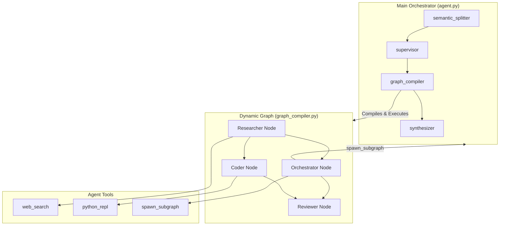

# Self-Spawn Agents: Architecture Walkthrough

## Executive Summary
This document describes a **production-ready agentic orchestration system** capable of:
- Decomposing complex tasks into atomic subtasks
- Dynamically planning and compiling execution graphs
- Recursively spawning sub-agents for complex sub-problems
- Self-validating results with confidence scores
- Executing Python code in secure E2B sandboxes

**Current Grade: A- (Architecture) | B+ (Data Quality)**

---

## System Architecture



---

## Module Summary

| Module | Purpose | Status |
|--------|---------|--------|
| **1: Semantic Splitter** | Decompose tasks into subtasks | ✅ Complete |
| **2: Supervisor Agent** | Plan execution graph | ✅ Complete |
| **3: Dynamic Graph Compiler** | Compile and execute dynamic LangGraph | ✅ Complete |
| **4: Recursive Subgraph Tool** | Agents spawn sub-workflows | ✅ Complete |
| **4.5: Quality Refinements** | Python REPL, semantic drift prevention | ✅ Complete |
| **5: RLM Orchestrator** | Deliverables tracking, synthesis node | ✅ Complete |
| **5.5: Search Refinements** | Query optimization, auto-refinement | ✅ Complete |

---

## File Structure

```
backend/
├── agent.py                    # Main LangGraph orchestrator
├── main.py                     # FastAPI application
├── agents/
│   ├── state.py                # AgentState TypedDict
│   ├── dependencies.py         # LLM instances, tools, constants
│   ├── semantic_splitter.py    # Module 1: Task decomposition
│   ├── supervisor_agent.py     # Module 2: Graph planning
│   ├── graph_compiler.py       # Module 3: Dynamic graph execution
│   ├── synthesizer.py          # Module 5: Final synthesis
│   ├── workers/
│   │   └── generic.py          # Generic worker with tool binding
│   └── tools/
│       ├── web_search.py       # Web search with metadata extraction
│       ├── python_repl.py      # E2B code execution
│       └── subgraph.py         # Recursive subgraph spawning
```

---

## Core Components

### 1. AgentState (state.py)
```python
class AgentState(TypedDict):
    task: str           # High-level user prompt
    subject: str        # Extracted subject for drift prevention
    subtasks: List[str] # Decomposed subtasks
    deliverables: List[str]  # Expected outputs
    graph_plan: Dict    # Planned nodes and edges
    results: Dict       # Execution results
    depth: int          # Recursion depth (max: 2)
```

### 2. Graph Flow (agent.py)
```
semantic_splitter → supervisor → graph_compiler → synthesizer → END
```

### 3. Agent Types (supervisor_agent.py)
| Type | Tool Access | Purpose |
|------|-------------|---------|
| Researcher | `web_search` | Information gathering |
| Coder | `python_repl` | Code execution |
| Reviewer | None | Quality review |
| Orchestrator | `spawn_subgraph` | Complex sub-problems |

---

## Key Features

### Feature 1: Subject Extraction & Drift Prevention
- `semantic_splitter` extracts the primary subject (e.g., "luxury e-bikes")
- All downstream nodes receive `<subject>` tag in their instructions
- Prevents agents from drifting to unrelated topics

### Feature 2: Search Metadata & Auto-Refinement
- `web_search` detects `Missing: X` patterns in results
- Automatically executes refined search with missing terms
- Appends `[REFINED SEARCH]` results to output

### Feature 3: Triple-Layer Validation
1. **Sub-agent validation**: Each recursive call validates its results
2. **Recursive compilation validation**: Parent validates child output
3. **Final synthesis validation**: Synthesizer checks deliverable coverage

### Feature 4: E2B Python Execution
- Secure cloud sandbox via `e2b-code-interpreter`
- Coder agents can execute calculations and scripts
- Results returned as structured output

### Feature 5: Recursive Subgraph Spawning
- `spawn_subgraph` tool invokes the entire orchestrator
- Depth limit: 2 (configurable via `MAX_RECURSION_DEPTH`)
- Each level maintains full validation chain

---

## Test Results

### E-Bike Market Strategy Test (v4)
**Prompt**: Market entry strategy for luxury e-bike brand in Mexico and Brazil

| Metric | Result |
|--------|--------|
| Subject Extraction | ✅ "luxury e-bikes" |
| Recursive Spawning | ✅ 2 levels deep |
| Python Execution | ✅ Landed cost calculated |
| Self-Validation | ✅ confidence: 0.2 flagged |
| Search Refinement | ✅ Auto-refined for "luxury" |
| Synthesis | ✅ Executive summary generated |

**Grade: A- (Architecture), B+ (Data Quality)**

### Validation Output Example
```json
{
  "is_valid": false,
  "issues": [
    "Results do not clearly identify top 5 luxury competitors",
    "Pricing models not provided"
  ],
  "confidence": 0.2
}
```

---

## API Endpoints

### POST /api/run
Execute the orchestrator with a task.

**Request:**
```json
{"task": "Your complex task description"}
```

**Response (SSE Stream):**
```
data: {"type": "progress", "message": "Decomposing task..."}
data: {"type": "result", "subtasks": [...]}
data: {"type": "result", "graph_plan": {...}}
data: {"type": "result", "results": {...}}
data: {"type": "synthesis", "markdown": "# Executive Summary..."}
```

### POST /api/cancel/{request_id}
Cancel a running orchestrator task.

---

## Environment Variables

| Variable | Purpose |
|----------|---------|
| `OPENAI_API_KEY` | LLM access |
| `SERPER_API_KEY` | Web search |
| `E2B_API_KEY` | Python sandbox |
| `LANGCHAIN_API_KEY` | LangSmith tracing |
| `LANGCHAIN_TRACING_V2` | Enable tracing |
| `LANGCHAIN_PROJECT` | Project name |

---

## Deployment

### Local Development
```bash
docker compose -f docker-compose.local.yml up --build -d
```

### Production
```bash
docker compose up --build -d
```

---

## Known Limitations

1. **Web Search Granularity**: General search engines don't index boutique retailers (e.g., luxury e-bike shops in Polanco, CDMX)
2. **Confidence Threshold**: Currently logs low confidence but doesn't escalate for human review (planned for Module 6)
3. **Recursion Depth**: Fixed at 2 levels to prevent exponential branching

---

## Next Steps (Module 6+)

- [ ] Confidence-based escalation to human review
- [ ] LLM synthesis fallback for low-confidence results
- [ ] Google Maps API for retail location mapping
- [ ] Real freight APIs (Shippo, FedEx) for landed costs
