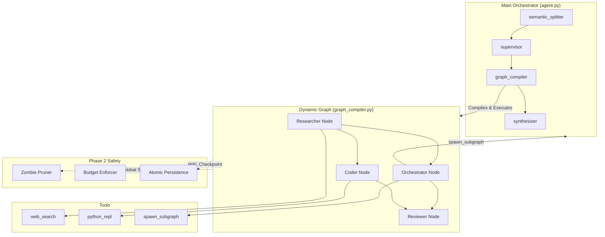

# Self-Spawn Agents: Architecture Walkthrough

## Executive Summary
This document describes a **production-ready agentic orchestration system** capable of:
- Decomposing complex tasks into atomic subtasks
- Dynamically planning and compiling execution graphs
- **Recursively spawning** sub-agents for complex sub-problems
- **Self-healing** via Zombie Branch Pruning and Budget Caps
- **Time-Traveling** via State Hydration and Surgical Rewinds
- Executing Python code in secure E2B sandboxes

**Current Grade: A (Architecture) | B+ (UI Polish)**

---

## System Architecture



---

## Module Summary

| Module | Purpose | Status |
|--------|---------|--------|
| **1: Semantic Splitter** | Decompose tasks into subtasks | ✅ Complete |
| **2: Supervisor Agent** | Plan execution graph | ✅ Complete |
| **3: Dynamic Graph Compiler** | Compile nodes, **enforce pruning** | ✅ Complete |
| **4: Recursive Subgraph Tool** | Agents spawn sub-workflows | ✅ Complete |
| **5: RLM Orchestrator** | Deliverables & Synthesis | ✅ Complete |
| **6: Safety & Escalation** | **Zombie Pruning, Budgets, Persistence** | ✅ Complete |
| **7: Visualization** | React + SSE Streaming | ✅ Complete |
| **8: Human-in-the-Loop** | **Time Travel, Forking, Rewinding** | ✅ Complete |

---

## File Structure

```
backend/
├── agent.py                    # Main LangGraph orchestrator
├── main.py                     # FastAPI application (Routes for Run/Hydrate/Fork)
├── agents/
│   ├── state.py                # AgentState TypedDict (Schema)
│   ├── dependencies.py         # LLM instances, tools, constants
│   ├── semantic_splitter.py    # Module 1: Task decomposition
│   ├── supervisor_agent.py     # Module 2: Graph planning
│   ├── graph_compiler.py       # Module 3: Dynamic graph + Safety Checks
│   ├── synthesizer.py          # Module 5: Final synthesis
│   ├── shared_memory.py        # Persistence (AsyncSqliteSaver)
│   ├── history.py              # Time Travel logic (Fork/Find Checkpoints)
│   ├── workers/
│   │   └── generic.py          # Generic worker with tool binding
│   └── tools/
│       ├── web_search.py       # Web search with metadata extraction
│       ├── python_repl.py      # E2B code execution
│       └── subgraph.py         # Recursive subgraph spawning
```

---

## Core Components

### 1. AgentState (state.py)
```python
class AgentState(TypedDict):
    task: str           # High-level user prompt
    subject: str        # Extracted subject for drift prevention
    subtasks: List[str] # Decomposed subtasks
    graph_plan: Dict    # Planned nodes and edges
    results: Dict       # Execution results
    depth: int          # Recursion depth
    # --- Phase 1: Output ---
    synthesis: str      # Final markdown report
    # --- Phase 2: Safety & HITL ---
    inner_thread_id: str   # Persisted ID for inner graph
    global_signal: str     # "INTERRUPT" to kill sibling branches
    usage_stats: Dict      # {"cost": 0.50, "steps": 12}
    budget_config: Dict    # {"max_cost": 2.0}
    blueprint_id: str      # Source blueprint reference
```

### 2. Graph Flow
```
semantic_splitter → supervisor → graph_compiler (runs dynamic graph) → synthesizer → END
```
*Note: The `graph_compiler` now includes pre-flight checks for Budgets and Global Signals.*

---

## Key Features

### Feature 1: Subject Extraction & Drift Prevention
- `semantic_splitter` extracts the primary subject
- Prevents agents from drifting to unrelated topics

### Feature 2: Validation & Refinement
- Triple-Layer Validation (Sub-agent -> Parent -> Synthesis)
- `web_search` auto-refines queries when results are missing

### Feature 3: E2B Python Execution
- Secure cloud sandbox via `e2b-code-interpreter`

### Feature 4: Recursive Subgraph Spawning
- `spawn_subgraph` tool invokes the entire orchestrator
- Depth limit: 2 (configurable)

### Feature 5: Safety Logic (Phase 2)
- **Atomic Persistence:** State checks saved after *every node*. Crash recovery is instant.
- **Zombie Branch Pruning:** If Sibling A fails (Tier 3), Sibling B (parallel) is immediately killed to save tokens.
- **Budget Caps:** Hard limits on `max_cost` and `max_steps`.

### Feature 6: Time Machine (Phase 2)
- **Hydration:** Clone any past run into a fresh thread.
- **Surgical Rewind:** Invalidate a specific node (e.g., "Writer") and re-run *only* that node and its successors, checking out a new branch from the past.

---

## API Endpoints

### POST /api/run
Execute the orchestrator.
**Request:**
```json
{
  "task": "Research X",
  "budget_config": {"max_cost": 2.0} 
}
```

### POST /api/hydrate
Fork a run or start from a blueprint.
**Request:**
```json
{
  "source_thread_id": "uuid-of-past-run",
  "blueprint": { ... }
}
```

### POST /api/run/{run_id}/fork
Surgically rewind a run from a specific node.
**Request:**
```json
{
  "node_id": "writer_agent",
  "modifications": { "new_instruction": "Use a better tone" }
}
```

---

## Next Steps (Epic 3: Optics)

- [ ] **Tier 2 Warning Badges**: Display "Yellow" status for low-confidence nodes in UI.
- [ ] **Real-Time Cost Badge**: Stream `usage_stats.cost` to the UI Header.

---

## Testing State Hydration

### 1. Forking a Run via UI
1.  Click **Fork Run** (⑂ icon) on any past run.
2.  **Verify:** New Run ID generated, history preserved, ready to "Start".

### 2. Manual Rewind via API
```powershell
Invoke-RestMethod -Uri "http://localhost:8000/api/run/{id}/fork" -Method Post -Body '{"node_id": "writer"}'
```
**Verify:** The graph creates a new branch starting exactly before the Writer node.
